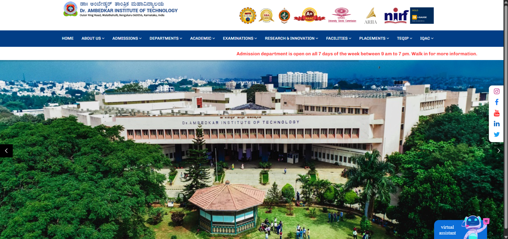
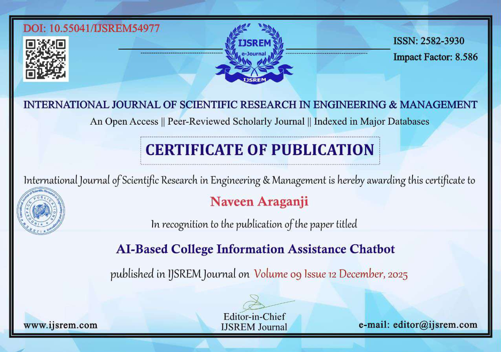

# 🤖 AI-Based College Information Assistance Chatbot

An AI-powered virtual assistant developed for **Dr. Ambedkar Institute of Technology** to provide students, faculty, and administrators with instant access to academic and administrative information. The chatbot uses **Natural Language Processing (NLP)** and **OpenRouter LLMs** to understand user queries and retrieve relevant information from a college database.

---

## 📌 Features

- 🤖 AI-powered conversational chatbot
- 🎤 Voice input using Speech-to-Text
- 🔊 Voice output using Text-to-Speech
- 📚 Study Materials
- 📅 Timetable Information
- 📖 Syllabus Access
- 📰 Latest Updates
- 🎓 Student Result Retrieval
- 👨‍🏫 Faculty Information
- 🔐 Admin Portal
- 📊 Attendance Management
- 🗄 SQLite Database Integration

---

## 🏗 System Architecture

```
User
   │
   ▼
Frontend (HTML/CSS/JavaScript)
   │
   ▼
Flask Backend
   │
   ├──────────────► SQLite Database
   │
   └──────────────► OpenRouter AI API
```

---

## 🛠 Technologies Used

### Programming Languages

- Python
- JavaScript
- HTML5
- CSS3
- SQL

### Frameworks

- Flask

### Database

- SQLite

### AI

- OpenRouter API
- Large Language Models (LLMs)

### Hardware

- Raspberry Pi 4B
- Microphone
- Speaker

---

## 📂 Project Structure

```
ai-based-college-information-assistance-chatbot/
│
├── app.py
├── db3.db
├── requirements.txt
├── README.md
├── templates/
├── static/
│
└── screenshots/
```

---

## 🏠 Home Page



---

## 💡 Future Enhancements

- ERP Integration
- Multi-language Support
- Mobile Application
- Student Authentication with SSO
- Cloud Database
- AI-powered Analytics

---

## 👨‍💻 Authors

- Sohan kumar A
- Mohan D
- Naveen Araganji
- Nithin N J

---

## 📄 Publication

Our research work has been published, and the publication certificate is shown below.

### 📜 Certificate of Publication



---